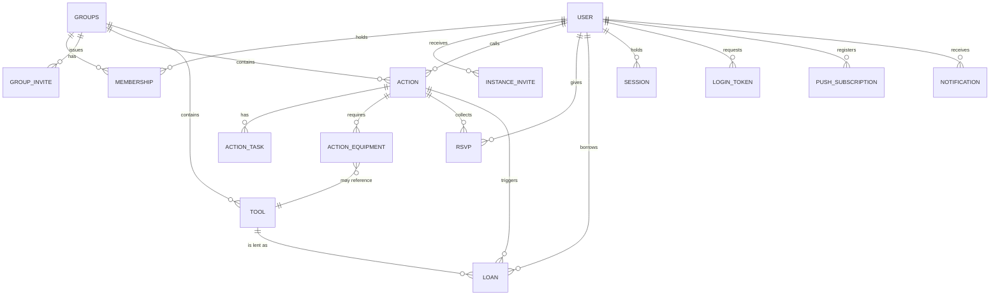

# Data model

Target: Cloudflare D1 (SQLite) accessed through Drizzle ORM (ADR-009).

Conventions used throughout:

- Primary keys are text ULIDs (`id`), sortable by creation time.
- Timestamps are integers, epoch milliseconds UTC, suffixed `_at`.
- Booleans are integers (0/1), named as predicates (`is_…`, `has_…`).
- Enumerations are text with a `CHECK` constraint, not integers — a schema dump
  should be readable without a lookup table.
- Every row that belongs to a tenant carries `group_id` directly, even where it
  could be derived. Denormalised on purpose: it makes the scope filter of
  ADR-014 a single predicate and makes a leak visible in review.
- Deletes are avoided. Rows carry state (`left`, `cancelled`, `retired_at`) or
  are anonymised (ADR-004).

## Entity overview

## Entities

### user

The person. Deliberately thin (NFR-6).

| Field           | Type                 | Notes                                        |
| --------------- | -------------------- | -------------------------------------------- |
| `id`            | text PK              |                                              |
| `display_name`  | text                 | "Former member" after anonymisation          |
| `email`         | text unique nullable | `NULL` after anonymisation                   |
| `locale`        | text                 | `sl` default                                 |
| `notify_email`  | int                  | default 1                                    |
| `notify_push`   | int                  | default 1                                    |
| `created_at`    | int                  |                                              |
| `last_seen_at`  | int                  | drives the 24-month inactivity sweep (FR-42) |
| `anonymised_at` | int nullable         | set by account deletion                      |

No phone, no address, no avatar, no date of birth.

### instance_invite

Gets a person into the system when they belong to no group yet (ADR-002).

| Field        | Type                    | Notes                                 |
| ------------ | ----------------------- | ------------------------------------- |
| `id`         | text PK                 |                                       |
| `token_hash` | text unique             | only the hash is stored               |
| `email`      | text nullable           | optional pre-binding to one recipient |
| `created_by` | text FK → user          | the operator                          |
| `expires_at` | int                     |                                       |
| `used_at`    | int nullable            |                                       |
| `used_by`    | text FK → user nullable |                                       |

### groups

The tenant. (`group` is reserved in SQL; the table is `groups`.)

| Field         | Type           | Notes                   |
| ------------- | -------------- | ----------------------- |
| `id`          | text PK        |                         |
| `name`        | text           |                         |
| `description` | text nullable  |                         |
| `created_by`  | text FK → user | becomes the first admin |
| `created_at`  | int            |                         |

### membership

Join between user and group, carrying role and lifecycle (FR-8).

| Field       | Type             | Notes               |
| ----------- | ---------------- | ------------------- |
| `id`        | text PK          |                     |
| `group_id`  | text FK → groups |                     |
| `user_id`   | text FK → user   |                     |
| `role`      | text             | `admin` \| `member` |
| `status`    | text             | `active` \| `left`  |
| `joined_at` | int              |                     |
| `left_at`   | int nullable     |                     |

Unique `(group_id, user_id)`. A group must always retain at least one `active`
admin — enforced in application logic, since SQLite cannot express it.

### group_invite

| Field        | Type             | Notes                       |
| ------------ | ---------------- | --------------------------- |
| `id`         | text PK          |                             |
| `group_id`   | text FK → groups |                             |
| `token_hash` | text unique      |                             |
| `created_by` | text FK → user   |                             |
| `expires_at` | int              | default now + 7 days (FR-6) |
| `max_uses`   | int              | default 1                   |
| `used_count` | int              | default 0                   |
| `revoked_at` | int nullable     |                             |

### action

A work day (FR-10, FR-11).

| Field              | Type                      | Notes                                                |
| ------------------ | ------------------------- | ---------------------------------------------------- |
| `id`               | text PK                   |                                                      |
| `group_id`         | text FK → groups          |                                                      |
| `created_by`       | text FK → user            | the caller; may edit                                 |
| `title`            | text                      |                                                      |
| `description`      | text nullable             |                                                      |
| `status`           | text                      | `draft` \| `published` \| `completed` \| `cancelled` |
| `starts_at`        | int                       |                                                      |
| `ends_at`          | int                       | expected end; may span days                          |
| `location_name`    | text                      |                                                      |
| `location_address` | text nullable             | free text                                            |
| `lat`, `lon`       | real nullable             | human-entered, never read from the device            |
| `min_participants` | int nullable              | FR-16                                                |
| `min_decision_at`  | int nullable              | deadline for the above                               |
| `max_participants` | int nullable              | FR-17                                                |
| `published_at`     | int nullable              |                                                      |
| `completed_at`     | int nullable              |                                                      |
| `cancelled_at`     | int nullable              |                                                      |
| `cancel_reason`    | text nullable             |                                                      |
| `duplicated_from`  | text FK → action nullable | FR-19                                                |

Invariants: `ends_at >= starts_at`; publishing requires at least one
`action_task` (FR-12); `min_decision_at <= starts_at`.

### action_task

| Field              | Type                    | Notes                      |
| ------------------ | ----------------------- | -------------------------- |
| `id`               | text PK                 |                            |
| `action_id`        | text FK → action        |                            |
| `group_id`         | text                    | denormalised scope         |
| `title`            | text                    |                            |
| `position`         | int                     | manual ordering            |
| `assignee_user_id` | text FK → user nullable |                            |
| `done_at`          | int nullable            | offline-toggleable (FR-38) |
| `done_by`          | text FK → user nullable |                            |

### action_equipment

What needs to be there, and who is bringing it (FR-14).

| Field        | Type                    | Notes                                    |
| ------------ | ----------------------- | ---------------------------------------- |
| `id`         | text PK                 |                                          |
| `action_id`  | text FK → action        |                                          |
| `group_id`   | text                    | denormalised scope                       |
| `label`      | text                    | free text, e.g. "chainsaw"               |
| `quantity`   | int                     | default 1                                |
| `tool_id`    | text FK → tool nullable | link to the catalogue                    |
| `brought_by` | text FK → user nullable | "I'll bring it"                          |
| `loan_id`    | text FK → loan nullable | created when a catalogue tool is claimed |

Invariant: if `tool_id` is set, that tool's `group_id` must match.

### rsvp

One row per person per action (FR-15, FR-20).

| Field           | Type                    | Notes                                                           |
| --------------- | ----------------------- | --------------------------------------------------------------- |
| `id`            | text PK                 |                                                                 |
| `action_id`     | text FK → action        |                                                                 |
| `group_id`      | text                    | denormalised scope                                              |
| `user_id`       | text FK → user          |                                                                 |
| `response`      | text nullable           | `yes` \| `no` \| `maybe`; `NULL` = never responded but attended |
| `responded_at`  | int nullable            |                                                                 |
| `attended`      | int nullable            | `NULL` = not recorded, 0/1 = ticked                             |
| `attendance_at` | int nullable            | offline-toggleable (FR-38)                                      |
| `attendance_by` | text FK → user nullable |                                                                 |

Unique `(action_id, user_id)`. Attendance lives here rather than in its own table
because it is one optional tick, and because someone who never responded but
turned up is simply a row with `response = NULL`.

### tool

| Field                | Type                    | Notes                                                        |
| -------------------- | ----------------------- | ------------------------------------------------------------ |
| `id`                 | text PK                 |                                                              |
| `group_id`           | text FK → groups        |                                                              |
| `owner_user_id`      | text FK → user nullable | `NULL` = owned by the group (FR-22)                          |
| `name`               | text                    |                                                              |
| `description`        | text nullable           |                                                              |
| `storage_note`       | text nullable           | "in Janez's garage" — treat as address-like (ADR-016)        |
| `condition`          | text                    | `ok` \| `damaged` \| `in_repair` \| `lost`                   |
| `visibility`         | text                    | `private` \| `group` \| `network`; default `group` (ADR-015) |
| `is_unavailable`     | int                     | default 0                                                    |
| `unavailable_reason` | text nullable           |                                                              |
| `created_by`         | text FK → user          |                                                              |
| `created_at`         | int                     |                                                              |
| `retired_at`         | int nullable            | set when the owner leaves the group (FR-8)                   |

Current holder is not a column: it is derived from the open loan. Storing it
would create a second source of truth that drifts.

### loan

Reservation, pickup and return in one row (FR-24 – FR-27).

| Field                    | Type                      | Notes                                            |
| ------------------------ | ------------------------- | ------------------------------------------------ |
| `id`                     | text PK                   |                                                  |
| `tool_id`                | text FK → tool            |                                                  |
| `group_id`               | text                      | denormalised scope                               |
| `borrower_user_id`       | text FK → user            |                                                  |
| `action_id`              | text FK → action nullable | set when claimed via equipment (FR-25)           |
| `status`                 | text                      | `reserved` \| `out` \| `returned` \| `cancelled` |
| `reserved_from`          | int nullable              |                                                  |
| `due_at`                 | int                       | defaults to the day after a linked action ends   |
| `picked_up_at`           | int nullable              |                                                  |
| `returned_at`            | int nullable              |                                                  |
| `return_condition`       | text nullable             | same enumeration as `tool.condition`             |
| `return_note`            | text nullable             |                                                  |
| `extended_count`         | int                       | default 0; incremented by "extend" (ADR-019)     |
| `overdue_reminders_sent` | int                       | default 0; capped at 3 (FR-32)                   |

Invariants: `due_at >= reserved_from`; at most one loan per tool in status `out`.
Overlapping `reserved` ranges are permitted and produce a warning (ADR-018).

### session, login_token

| Table         | Fields                                                                                 |
| ------------- | -------------------------------------------------------------------------------------- |
| `session`     | `id` (PK, opaque), `user_id`, `created_at`, `expires_at`, `last_used_at`, `user_agent` |
| `login_token` | `id`, `token_hash`, `email`, `expires_at` (≈15 min), `used_at`, `requested_ip`         |

Sessions are stored in D1, not KV: sign-out and revocation must be
read-after-write, which KV does not guarantee.

### push_subscription

| Field                      | Type           | Notes                          |
| -------------------------- | -------------- | ------------------------------ |
| `id`                       | text PK        |                                |
| `user_id`                  | text FK → user |                                |
| `endpoint`                 | text unique    |                                |
| `p256dh`, `auth`           | text           | Web Push keys                  |
| `created_at`, `last_ok_at` | int            |                                |
| `failed_count`             | int            | pruned after repeated failures |

### notification

One row per intended delivery, so that reminders are idempotent across Cron runs.

| Field                        | Type           | Notes                                                                                                                                                                              |
| ---------------------------- | -------------- | ---------------------------------------------------------------------------------------------------------------------------------------------------------------------------------- |
| `id`                         | text PK        |                                                                                                                                                                                    |
| `user_id`                    | text FK → user |                                                                                                                                                                                    |
| `group_id`                   | text nullable  | for per-group muting (FR-33)                                                                                                                                                       |
| `type`                       | text           | `action_published`, `action_changed`, `action_cancelled`, `min_deadline`, `reminder_48h`, `reminder_3h`, `loan_created`, `loan_returned`, `loan_due`, `loan_overdue`, `loan_nudge` |
| `subject_type`, `subject_id` | text           | the action or loan concerned                                                                                                                                                       |
| `channel`                    | text           | `email` \| `push`                                                                                                                                                                  |
| `scheduled_for`              | int            |                                                                                                                                                                                    |
| `sent_at`                    | int nullable   |                                                                                                                                                                                    |
| `error`                      | text nullable  |                                                                                                                                                                                    |

Unique `(user_id, type, subject_id, channel)` — the constraint that stops a
retried Cron Trigger from sending the same reminder twice.

### sync_queue (client side only)

Not a D1 table. IndexedDB store holding queued offline toggles (FR-38):
`op_id` (idempotency key), `kind` (`task_toggle` \| `attendance_toggle`),
`target_id`, `value`, `queued_at`. Replayed on reconnect; the server applies
last-write-wins and returns the authoritative state.

## Access rules

1. Every read and write resolves through the scope helper of ADR-014, which
   takes `(session.user_id, active_group_id)` and returns a predicate. No route
   composes `group_id = ?` by hand.
2. `membership.status` must be `active` for any write. A `left` member keeps
   read access to nothing.
3. Tool visibility resolves inside the same helper. In the MVP it maps
   `private` → owner only, `group` → active members, `network` → _no results_.
   Enabling the network scope later is a change in one function (ADR-015).
4. Anonymisation touches `user` only. Rows referencing the user keep their
   foreign key and display "Former member".

## Indexes worth having on day one

- `membership (user_id, status)` — the switcher and every scope check
- `membership (group_id, status)` — member lists
- `action (group_id, status, starts_at)` — the main list and reminder sweeps
- `rsvp (action_id)`, `rsvp (user_id)` — attendance counts on a profile
- `tool (group_id, retired_at)` and `tool (owner_user_id)` — catalogue
- `loan (tool_id, status)` and `loan (status, due_at)` — the overdue sweep
- `notification (scheduled_for, sent_at)` — the Cron Trigger's working set
